# Vegarden

Vegarden is a social blogging network focused on promoting veganism and
creating a community of people interested in vegan philosophy.
This project aims to create a space where users, known as Zenytes,
can express themselves, share experiences, and contribute to the
vegan community through their personal blogs.

## Disclaimer

This application, was developed as a capstone project for the Epicode bootcamp and has not been tested on a wide range of devices or environments. It has only been tested on my personal machine. Therefore, there may be some bugs or compatibility issues that may arise when the application is run on other devices or environments.

## Features

- Login, logout and registration
- Edit profile
- Article creation, editing and deletion
- Like and save article
- Visit other ZenHubs
- Suggested zenytes
- Search zenytes by username
- Follow system to connect with other zenytes
- Homepage with trend and zenyted section
- ZenHub with my blog and saved section
- Filter articles by category on the homepage

## To Do

- Comment and share articles
- Content Moderation
- Instant Messaging
- Notifications
- Email informations
- Dedicated page for the blog
- Collaborative article writing
- Collaborative article writing
- And other features typical of a social network 🙃

## Tech stack

### Backend:

- [Java 17](https://www.java.com/en/)
- [Spring Boot 3.11](https://spring.io/projects/spring-boot)
- [PostgreSQL 14.8](https://www.postgresql.org/)

### Frontend:

- [TypeScript 5.0.2](https://www.typescriptlang.org/)
- [React 18.2.0](https://react.dev/)
- [Vite 9.6.7](https://vitejs.dev/)
- [Bootstrap 9.5.1](https://getbootstrap.com/)
- [Sass 1.63.6](https://sass-lang.com/)

## Screenshot

- Login 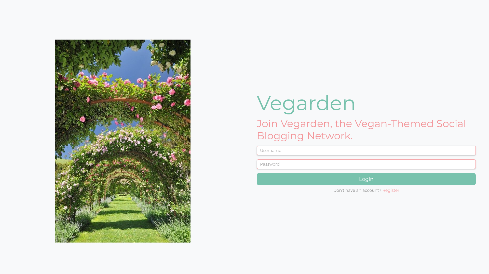
- Registration 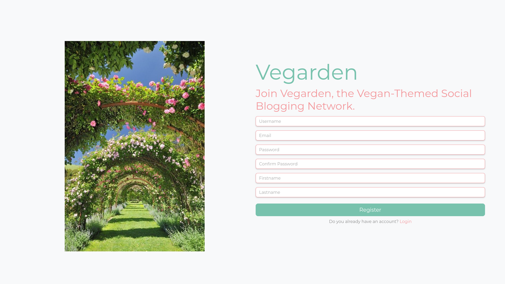
- Homepage 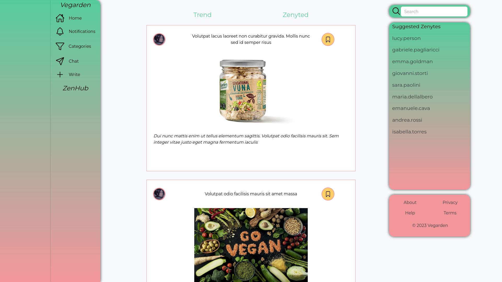
- ZenHub 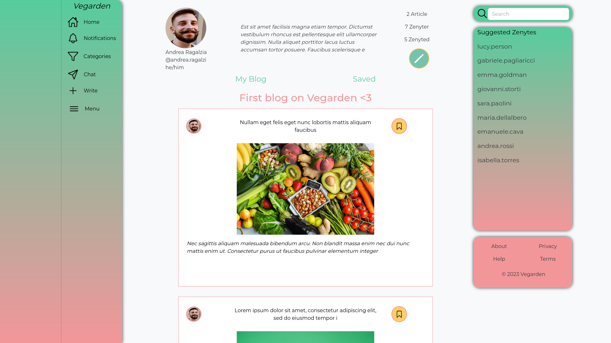
- Edit Zenyte 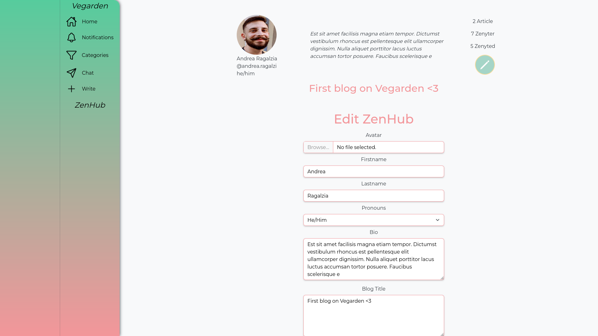
- Article 1 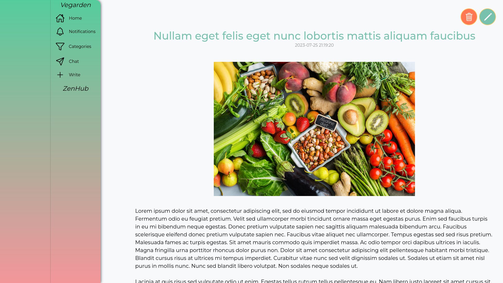
- Article 2 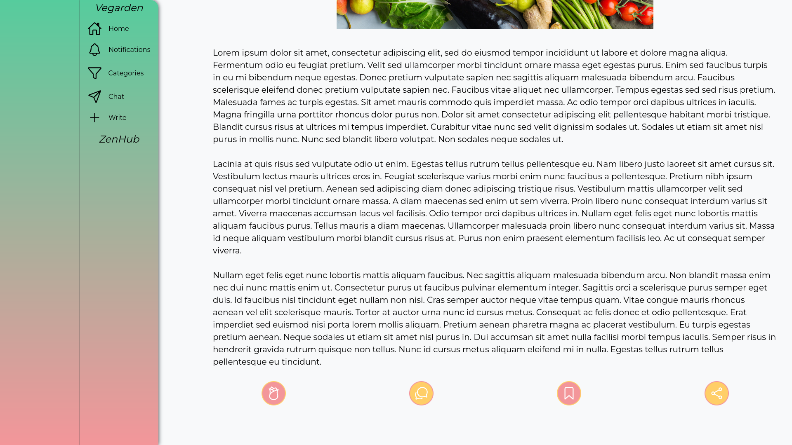
- Write Article 1 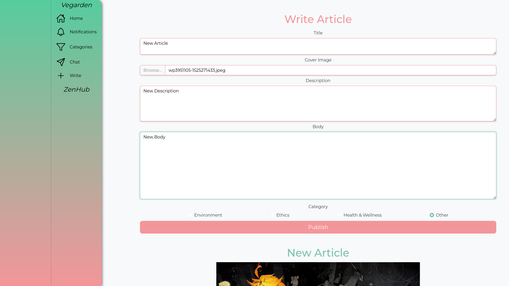
- Write Article 2 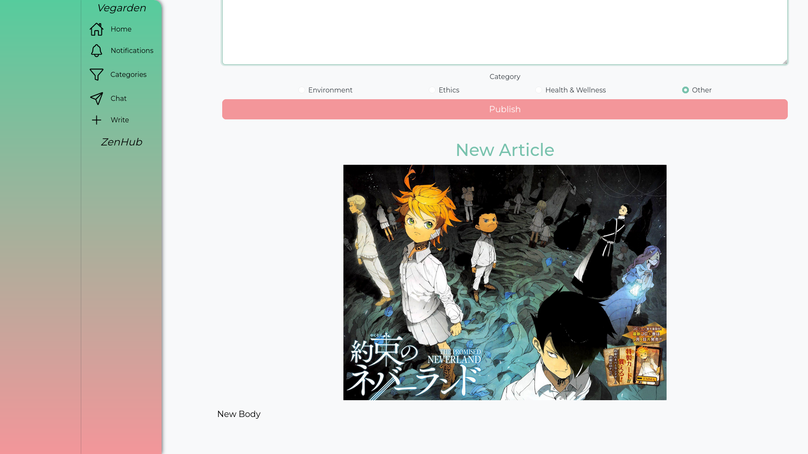
- Edit Article 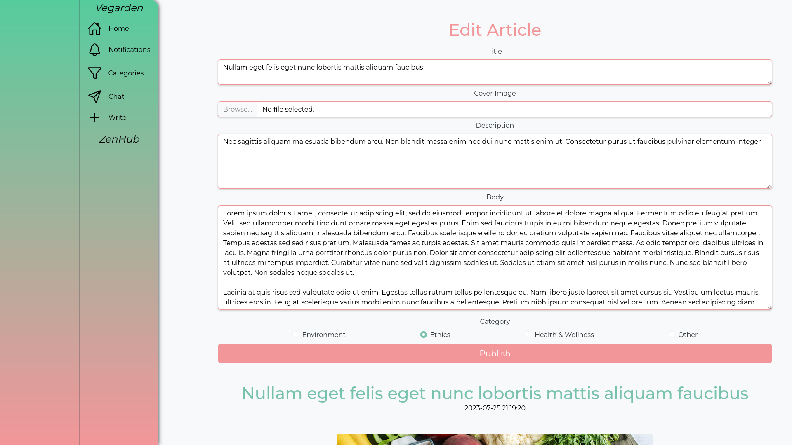
- Other ZenHub 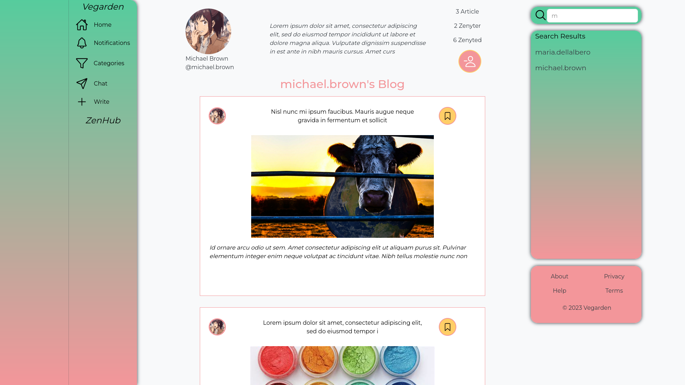
- Categories 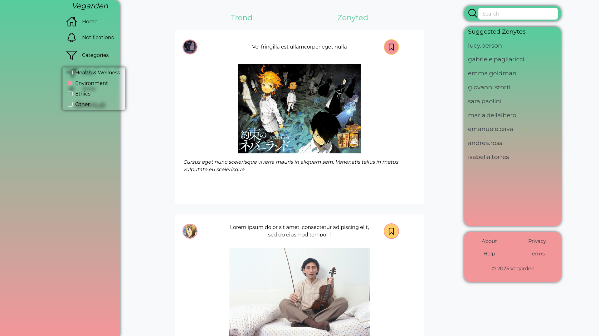

## Thank you for your interest in Vegarden!

### Contact

You can reach me through the following channels:

- Email: [andrea.ragalzi.code@gmail.com](mailto:andrea.ragalzi.code@gmail.com)
- Twitter: [@andrea_ragalzi](https://twitter.com/andrea_ragalzi)

### Contributions and Collaboration

Vegarden is an open source project and welcomes contributions from the community. If you'd like to contribute to the project, you can open issues, propose new features, or submit pull requests. We're grateful to everyone who has contributed and those who will contribute in the future to make Vegarden even better.
